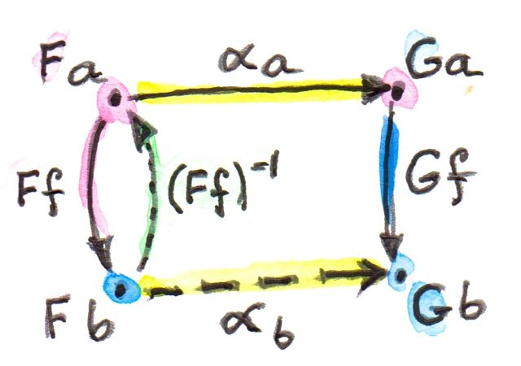
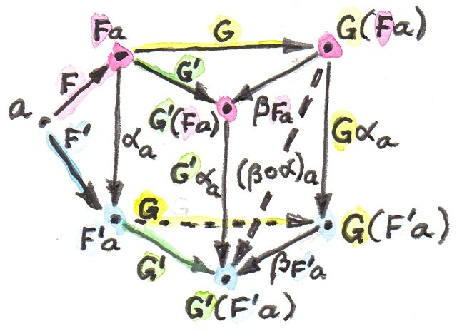

=======================
Natural Transformations
=======================

We talked about functors as mappings between categories that preserve
their structure. A functor “embeds” one category in another. It may
collapse multiple things into one, but it never breaks connections. One
way of thinking about it is that with a functor we are modeling one
category inside another. The source category serves as a model, a
blueprint, for some structure that’s part of the target category.

|1_Functors|

There may be many ways of embedding one category in another. Sometimes
they are equivalent, sometimes very different. One may collapse the
whole source category into one object, another may map every object to a
different object and every morphism to a different morphism. The same
blueprint may be realized in many different ways. Natural
transformations help us compare these realizations. They are mappings of
functors — special mappings that preserve their functorial nature.

Consider two functors ``F`` and ``G`` between categories *C* and *D*. If
you focus on just one object ``a`` in *C*, it is mapped to two objects:
``F a`` and ``G a``. A mapping of functors should therefore map ``F a``
to ``G a``.

|2_NatComp|

Notice that ``F a`` and ``G a`` are objects in the same category *D*.
Mappings between objects in the same category should not go against the
grain of the category. We don’t want to make artificial connections
between objects. So it’s *natural* to use existing connections, namely
morphisms. A natural transformation is a selection of morphisms: for
every object ``a``, it picks one morphism from ``F a`` to ``G a``. If we
call the natural transformation ``α``, this morphism is called the
*component* of ``α`` at ``a``, or ``αa``.

.. code-block:: haskell

    αa :: F a -> G a

Keep in mind that ``a`` is an object in *C* while ``αa`` is a morphism
in *D*.

If, for some ``a``, there is no morphism between ``F a`` and ``G a`` in
*D*, there can be no natural transformation between ``F`` and ``G``.

Of course that’s only half of the story, because functors not only map
objects, they map morphisms as well. So what does a natural
transformation do with those mappings? It turns out that the mapping of
morphisms is fixed — under any natural transformation between F and G,
``F f`` must be transformed into ``G f``. What’s more, the mapping of
morphisms by the two functors drastically restricts the choices we have
in defining a natural transformation that’s compatible with it. Consider
a morphism ``f`` between two objects ``a`` and ``b`` in *C*. It’s mapped
to two morphisms, ``F f`` and ``G f`` in *D*:

.. code-block:: haskell

    F f :: F a -> F b
    G f :: G a -> G b

The natural transformation ``α`` provides two additional morphisms that
complete the diagram in *D*:

.. code-block:: haskell

    αa :: F a -> G a
    αb :: F b -> G b

|3_Naturality|

Now we have two ways of getting from ``F a`` to ``G b``. To make sure
that they are equal, we must impose the *naturality condition* that
holds for any ``f``:

::

    G f ∘ αa = αb ∘ F f

The naturality condition is a pretty stringent requirement. For
instance, if the morphism ``F f`` is invertible, naturality determines
``αb`` in terms of ``αa``. It *transports* ``αa`` along ``f``:

::

    αb = (G f) ∘ αa ∘ (F f)-1

|4_Transport|

If there is more than one invertible morphism between two objects, all
these transports have to agree. In general, though, morphisms are not
invertible; but you can see that the existence of natural
transformations between two functors is far from guaranteed. So the
scarcity or the abundance of functors that are related by natural
transformations may tell you a lot about the structure of categories
between which they operate. We’ll see some examples of that when we talk
about limits and the Yoneda lemma.

Looking at a natural transformation component-wise, one may say that it
maps objects to morphisms. Because of the naturality condition, one may
also say that it maps morphisms to commuting squares — there is one
commuting naturality square in *D* for every morphism in *C*.

|Naturality|

This property of natural transformations comes in very handy in a lot of
categorical constructions, which often include commuting diagrams. With
a judicious choice of functors, a lot of these commutativity conditions
may be transformed into naturality conditions. We’ll see examples of
that when we get to limits, colimits, and adjunctions.

Finally, natural transformations may be used to define isomorphisms of
functors. Saying that two functors are naturally isomorphic is almost
like saying they are the same. *Natural isomorphism* is defined as a
natural transformation whose components are all isomorphisms (invertible
morphisms).

Polymorphic Functions
=====================

We talked about the role of functors (or, more specifically,
endofunctors) in programming. They correspond to type constructors that
map types to types. They also map functions to functions, and this
mapping is implemented by a higher order function ``fmap`` (or
``transform``, ``then``, and the like in C++).

To construct a natural transformation we start with an object, here a
type, ``a``. One functor, ``F``, maps it to the type ``F a``. Another
functor, ``G``, maps it to ``G a``. The component of a natural
transformation ``alpha`` at ``a`` is a function from ``F a`` to ``G a``.
In pseudo-Haskell:

.. code-block:: haskell

    alphaa :: F a -> G a

A natural transformation is a polymorphic function that is defined for
all types ``a``:

.. code-block:: haskell

    alpha :: forall a . F a -> G a

The ``forall a`` is optional in Haskell (and in fact requires turning on
the language extension ``ExplicitForAll``). Normally, you would write it
like this:

.. code-block:: haskell

    alpha :: F a -> G a

Keep in mind that it’s really a family of functions parameterized by
``a``. This is another example of the terseness of the Haskell syntax. A
similar construct in C++ would be slightly more verbose:

.. code-block:: c++

    template<class A> G<A> alpha(F<A>);

There is a more profound difference between Haskell’s polymorphic
functions and C++ generic functions, and it’s reflected in the way these
functions are implemented and type-checked. In Haskell, a polymorphic
function must be defined uniformly for all types. One formula must work
across all types. This is called *parametric polymorphism*.

C++, on the other hand, supports by default \ *ad hoc polymorphism*,
which means that a template doesn’t have to be well-defined for all
types. Whether a template will work for a given type is decided at
instantiation time, where a concrete type is substituted for the type
parameter. Type checking is deferred, which unfortunately often leads to
incomprehensible error messages.

In C++, there is also a mechanism for function overloading and template
specialization, which allows different definitions of the same function
for different types. In Haskell this functionality is provided by type
classes and type families.

Haskell’s parametric polymorphism has an unexpected consequence: any
polymorphic function of the type:

.. code-block:: haskell

    alpha :: F a -> G a

where ``F`` and ``G`` are functors, automatically satisfies the
naturality condition. Here it is in categorical notation (``f`` is a
function ``f::a->b``):

::

    G f ∘ αa = αb ∘ F f

In Haskell, the action of a functor ``G`` on a morphism ``f`` is
implemented using ``fmap``. I’ll first write it in pseudo-Haskell, with
explicit type annotations:

.. code-block:: haskell

    fmapG f . alphaa = alphab . fmapF f

Because of type inference, these annotations are not necessary, and the
following equation holds:

.. code-block:: haskell

    fmap f . alpha = alpha . fmap f

This is still not real Haskell — function equality is not expressible in
code — but it’s an identity that can be used by the programmer in
equational reasoning; or by the compiler, to implement optimizations.

The reason why the naturality condition is automatic in Haskell has to
do with “theorems for free.” Parametric polymorphism, which is used to
define natural transformations in Haskell, imposes very strong
limitations on the implementation — one formula for all types. These
limitations translate into equational theorems about such functions. In
the case of functions that transform functors, free theorems are the
naturality conditions. [You may read more about free theorems in my blog
`Parametricity: Money for Nothing and Theorems for
Free <https://bartoszmilewski.com/2014/09/22/parametricity-money-for-nothing-and-theorems-for-free/>`__.]

One way of thinking about functors in Haskell that I mentioned earlier
is to consider them generalized containers. We can continue this analogy
and consider natural transformations to be recipes for repackaging the
contents of one container into another container. We are not touching
the items themselves: we don’t modify them, and we don’t create new
ones. We are just copying (some of) them, sometimes multiple times, into
a new container.

The naturality condition becomes the statement that it doesn’t matter
whether we modify the items first, through the application of ``fmap``,
and repackage later; or repackage first, and then modify the items in
the new container, with its own implementation of ``fmap``. These two
actions, repackaging and ``fmap``\ ping, are orthogonal. “One moves the
eggs, the other boils them.”

Let’s see a few examples of natural transformations in Haskell. The
first is between the list functor, and the ``Maybe`` functor. It returns
the head of the list, but only if the list is non-empty:

.. code-block:: haskell

    safeHead :: [a] -> Maybe a
    safeHead [] = Nothing
    safeHead (x:xs) = Just x

It’s a function polymorphic in ``a``. It works for any type ``a``, with
no limitations, so it is an example of parametric polymorphism.
Therefore it is a natural transformation between the two functors. But
just to convince ourselves, let’s verify the naturality condition.

.. code-block:: haskell

    fmap f . safeHead = safeHead . fmap f

We have two cases to consider; an empty list:

.. code-block:: haskell

    fmap f (safeHead []) = fmap f Nothing = Nothing

.. code-block:: haskell

    safeHead (fmap f []) = safeHead [] = Nothing

and a non-empty list:

.. code-block:: haskell

    fmap f (safeHead (x:xs)) = fmap f (Just x) = Just (f x)

.. code-block:: haskell

    safeHead (fmap f (x:xs)) = safeHead (f x : fmap f xs) = Just (f x)

I used the implementation of ``fmap`` for lists:

.. code-block:: haskell

    fmap f [] = []
    fmap f (x:xs) = f x : fmap f xs

and for ``Maybe``:

.. code-block:: haskell

    fmap f Nothing = Nothing
    fmap f (Just x) = Just (f x)

An interesting case is when one of the functors is the trivial ``Const``
functor. A natural transformation from or to a ``Const`` functor looks
just like a function that’s either polymorphic in its return type or in
its argument type.

For instance, ``length`` can be thought of as a natural transformation
from the list functor to the ``Const Int`` functor:

.. code-block:: haskell

    length :: [a] -> Const Int a
    length [] = Const 0
    length (x:xs) = Const (1 + unConst (length xs))

Here, ``unConst`` is used to peel off the ``Const`` constructor:

.. code-block:: haskell

    unConst :: Const c a -> c
    unConst (Const x) = x

Of course, in practice ``length`` is defined as:

.. code-block:: haskell

    length :: [a] -> Int

which effectively hides the fact that it’s a natural transformation.

Finding a parametrically polymorphic function *from* a ``Const`` functor
is a little harder, since it would require the creation of a value from
nothing. The best we can do is:

.. code-block:: haskell

    scam :: Const Int a -> Maybe a
    scam (Const x) = Nothing

Another common functor that we’ve seen already, and which will play an
important role in the Yoneda lemma, is the ``Reader`` functor. I will
rewrite its definition as a ``newtype``:

.. code-block:: haskell

    newtype Reader e a = Reader (e -> a)

It is parameterized by two types, but is (covariantly) functorial only
in the second one:

.. code-block:: haskell

    instance Functor (Reader e) where
        fmap f (Reader g) = Reader (\x -> f (g x))

For every type ``e``, you can define a family of natural transformations
from ``Reader e`` to any other functor ``f``. We’ll see later that the
members of this family are always in one to one correspondence with the
elements of ``f e`` (the :doc:`Yoneda
lemma <../part2/15-the-yoneda-lemma>`).

For instance, consider the somewhat trivial unit type ``()`` with one
element ``()``. The functor ``Reader ()`` takes any type ``a`` and maps
it into a function type ``()->a``. These are just all the functions that
pick a single element from the set ``a``. There are as many of these as
there are elements in ``a``. Now let’s consider natural transformations
from this functor to the ``Maybe`` functor:

.. code-block:: haskell

    alpha :: Reader () a -> Maybe a

There are only two of these, ``dumb`` and ``obvious``:

.. code-block:: haskell

    dumb (Reader _) = Nothing

and

.. code-block:: haskell

    obvious (Reader g) = Just (g ())

(The only thing you can do with ``g`` is to apply it to the unit value
``()``.)

And, indeed, as predicted by the Yoneda lemma, these correspond to the
two elements of the ``Maybe ()`` type, which are ``Nothing`` and
``Just ()``. We’ll come back to the Yoneda lemma later — this was just a
little teaser.

Beyond Naturality
=================
   :name: beyond-naturality

A parametrically polymorphic function between two functors (including
the edge case of the ``Const`` functor) is always a natural
transformation. Since all standard algebraic data types are functors,
any polymorphic function between such types is a natural transformation.

We also have function types at our disposal, and those are functorial in
their return type. We can use them to build functors (like the
``Reader`` functor) and define natural transformations that are
higher-order functions.

However, function types are not covariant in the argument type. They are
*contravariant*. Of course contravariant functors are equivalent to
covariant functors from the opposite category. Polymorphic functions
between two contravariant functors are still natural transformations in
the categorical sense, except that they work on functors from the
opposite category to Haskell types.

You might remember the example of a contravariant functor we’ve looked
at before:

.. code-block:: haskell

    newtype Op r a = Op (a -> r)

This functor is contravariant in ``a``:

.. code-block:: haskell

    instance Contravariant (Op r) where
        contramap f (Op g) = Op (g . f)

We can write a polymorphic function from, say, ``Op Bool`` to
``Op String``:

.. code-block:: haskell

    predToStr (Op f) = Op (\x -> if f x then "T" else "F")

But since the two functors are not covariant, this is not a natural
transformation in **Hask**. However, because they are both
contravariant, they satisfy the “opposite” naturality condition:

.. code-block:: haskell

    contramap f . predToStr = predToStr . contramap f

Notice that the function ``f`` must go in the opposite direction than
what you’d use with ``fmap``, because of the signature of ``contramap``:

.. code-block:: haskell

    contramap :: (b -> a) -> (Op Bool a -> Op Bool b)

Are there any type constructors that are not functors, whether covariant
or contravariant? Here’s one example:

.. code-block:: haskell

    a -> a

This is not a functor because the same type ``a`` is used both in the
negative (contravariant) and positive (covariant) position. You can’t
implement ``fmap`` or ``contramap`` for this type. Therefore a function
of the signature:

.. code-block:: haskell

    (a -> a) -> f a

where ``f`` is an arbitrary functor, cannot be a natural transformation.
Interestingly, there is a generalization of natural transformations,
called dinatural transformations, that deals with such cases. We’ll get
to them when we discuss ends.

Functor Category
================

Now that we have mappings between functors — natural transformations —
it’s only natural to ask the question whether functors form a category.
And indeed they do! There is one category of functors for each pair of
categories, C and D. Objects in this category are functors from C to D,
and morphisms are natural transformations between those functors.

We have to define composition of two natural transformations, but that’s
quite easy. The components of natural transformations are morphisms, and
we know how to compose morphisms.

Indeed, let’s take a natural transformation α from functor F to G. Its
component at object ``a`` is some morphism:

.. code-block:: haskell

    αa :: F a -> G a

We’d like to compose α with β, which is a natural transformation from
functor G to H. The component of β at ``a`` is a morphism:

.. code-block:: haskell

    βa :: G a -> H a

These morphisms are composable and their composition is another
morphism:

::

    βa ∘ αa :: F a -> H a

We will use this morphism as the component of the natural transformation
β ⋅ α — the composition of two natural transformations β after α:

::

    (β ⋅ α)a = βa ∘ αa

|5_Vertical|

One (long) look at a diagram convinces us that the result of this
composition is indeed a natural transformation from F to H:

::

    H f ∘ (β ⋅ α)a = (β ⋅ α)b ∘ F f

|6_VerticalNaturality|

Composition of natural transformations is associative, because their
components, which are regular morphisms, are associative with respect to
their composition.

Finally, for each functor F there is an identity natural transformation
1\ :sub:`F` whose components are the identity morphisms:

.. code-block:: haskell

    idF a :: F a -> F a

So, indeed, functors form a category.

A word about notation. Following Saunders Mac Lane I use the dot for the
kind of natural transformation composition I have just described. The
problem is that there are two ways of composing natural transformations.
This one is called the vertical composition, because the functors are
usually stacked up vertically in the diagrams that describe it. Vertical
composition is important in defining the functor category. I’ll explain
horizontal composition shortly.

|6a_Vertical|

The functor category between categories C and D is written as
``Fun(C, D)``, or ``[C, D]``, or sometimes as ``DC``. This last notation
suggests that a functor category itself might be considered a function
object (an exponential) in some other category. Is this indeed the case?

Let’s have a look at the hierarchy of abstractions that we’ve been
building so far. We started with a category, which is a collection of
objects and morphisms. Categories themselves (or, strictly speaking
*small* categories, whose objects form sets) are themselves objects in a
higher-level category **Cat**. Morphisms in that category are functors.
A Hom-set in **Cat** is a set of functors. For instance Cat(C, D) is a
set of functors between two categories C and D.

|7_CatHomSet|

A functor category [C, D] is also a set of functors between two
categories (plus natural transformations as morphisms). Its objects are
the same as the members of Cat(C, D). Moreover, a functor category,
being a category, must itself be an object of **Cat** (it so happens
that the functor category between two small categories is itself small).
We have a relationship between a Hom-set in a category and an object in
the same category. The situation is exactly like the exponential object
that we’ve seen in the last section. Let’s see how we can construct the
latter in **Cat**.

As you may remember, in order to construct an exponential, we need to
first define a product. In **Cat**, this turns out to be relatively
easy, because small categories are *sets* of objects, and we know how to
define cartesian products of sets. So an object in a product category C
× D is just a pair of objects, ``(c, d)``, one from C and one from D.
Similarly, a morphism between two such pairs, ``(c, d)`` and
``(c', d')``, is a pair of morphisms, ``(f, g)``, where ``f :: c -> c'``
and ``g :: d -> d'``. These pairs of morphisms compose component-wise,
and there is always an identity pair that is just a pair of identity
morphisms. To make the long story short, **Cat** is a full-blown
cartesian closed category in which there is an exponential object
D\ :sup:`C` for any pair of categories. And by “object” in **Cat** I
mean a category, so D\ :sup:`C` is a category, which we can identify
with the functor category between C and D.

2-Categories
============

With that out of the way, let’s have a closer look at **Cat**. By
definition, any Hom-set in **Cat** is a set of functors. But, as we have
seen, functors between two objects have a richer structure than just a
set. They form a category, with natural transformations acting as
morphisms. Since functors are considered morphisms in **Cat**, natural
transformations are morphisms between morphisms.

This richer structure is an example of a 2-category, a generalization of
a category where, besides objects and morphisms (which might be called
1-morphisms in this context), there are also 2-morphisms, which are
morphisms between morphisms.

In the case of **Cat** seen as a 2-category we have:

-  Objects: (Small) categories
-  1-morphisms: Functors between categories
-  2-morphisms: Natural transformations between functors.

Instead of a Hom-set between two categories C and D, we have a
Hom-category — the functor category D\ :sup:`C`. We have regular functor
composition: a functor F from D\ :sup:`C` composes with a functor G from
E\ :sup:`D` to give G ∘ F from E\ :sup:`C`. But we also have composition
inside each Hom-category — vertical composition of natural
transformations, or 2-morphisms, between functors.

|8_Cat-2-Cat|

With two kinds of composition in a 2-category, the question arises: How
do they interact with each other?

Let’s pick two functors, or 1-morphisms, in **Cat**:

.. code-block:: haskell

    F :: C -> D
    G :: D -> E

and their composition:

::

    G ∘ F :: C -> E

Suppose we have two natural transformations, α and β, that act,
respectively, on functors F and G:

.. code-block:: haskell

    α :: F -> F'
    β :: G -> G'

|10_Horizontal|

Notice that we cannot apply vertical composition to this pair, because
the target of α is different from the source of β. In fact they are
members of two different functor categories: D :sup:`C` and E :sup:`D`.
We can, however, apply composition to the functors F’ and G’, because
the target of F’ is the source of G’ — it’s the category D. What’s the
relation between the functors G’∘ F’ and G ∘ F?

Having α and β at our disposal, can we define a natural transformation
from G ∘ F to G’∘ F’? Let me sketch the construction.

|9_Horizontal|

As usual, we start with an object ``a`` in C. Its image splits into two
objects in D: ``F a`` and ``F'a``. There is also a morphism, a component
of α, connecting these two objects:

.. code-block:: haskell

    αa :: F a -> F'a

When going from D to E, these two objects split further into four
objects:

.. code-block:: haskell

    G (F a), G'(F a), G (F'a), G'(F'a)

We also have four morphisms forming a square. Two of these morphisms are
the components of the natural transformation β:

.. code-block:: haskell

    βF a :: G (F a) -> G'(F a)
    βF'a :: G (F'a) -> G'(F'a)

The other two are the images of α\ :sub:`a` under the two functors
(functors map morphisms):

.. code-block:: haskell

    G αa :: G (F a) -> G (F'a)
    G'αa :: G'(F a) -> G'(F'a)

That’s a lot of morphisms. Our goal is to find a morphism that goes from
``G (F a)`` to ``G'(F'a)``, a candidate for the component of a natural
transformation connecting the two functors G ∘ F and G’∘ F’. In fact
there’s not one but two paths we can take from ``G (F a)`` to
``G'(F'a)``:

::

    G'αa ∘ βF a
    βF'a ∘ G αa

Luckily for us, they are equal, because the square we have formed turns
out to be the naturality square for β.

We have just defined a component of a natural transformation from G ∘ F
to G’∘ F’. The proof of naturality for this transformation is pretty
straightforward, provided you have enough patience.

We call this natural transformation the *horizontal composition* of α
and β:

::

    β ∘ α :: G ∘ F -> G'∘ F'

Again, following Mac Lane I use the small circle for horizontal
composition, although you may also encounter star in its place.

Here’s a categorical rule of thumb: Every time you have composition, you
should look for a category. We have vertical composition of natural
transformations, and it’s part of the functor category. But what about
the horizontal composition? What category does that live in?

The way to figure this out is to look at **Cat** sideways. Look at
natural transformations not as arrows between functors but as arrows
between categories. A natural transformation sits between two
categories, the ones that are connected by the functors it transforms.
We can think of it as connecting these two categories.

|Sideways|

Let’s focus on two objects of **Cat** — categories C and D. There is a
set of natural transformations that go between functors that connect C
to D. These natural transformations are our new arrows from C to D. By
the same token, there are natural transformations going between functors
that connect D to E, which we can treat as new arrows going from D to E.
Horizontal composition is the composition of these arrows.

We also have an identity arrow going from C to C. It’s the identity
natural transformation that maps the identity functor on C to itself.
Notice that the identity for horizontal composition is also the identity
for vertical composition, but not vice versa.

Finally, the two compositions satisfy the interchange law:

::

    (β' ⋅ α') ∘ (β ⋅ α) = (β' ∘ β) ⋅ (α' ∘ α)

I will quote Saunders Mac Lane here: The reader may enjoy writing down
the evident diagrams needed to prove this fact.

There is one more piece of notation that might come in handy in the
future. In this new sideways interpretation of **Cat** there are two
ways of getting from object to object: using a functor or using a
natural transformation. We can, however, re-interpret the functor arrow
as a special kind of natural transformation: the identity natural
transformation acting on this functor. So you’ll often see this
notation:

::

    F ∘ α

where F is a functor from D to E, and α is a natural transformation
between two functors going from C to D. Since you can’t compose a
functor with a natural transformation, this is interpreted as a
horizontal composition of the identity natural transformation
1\ :sub:`F` after α.

Similarly:

::

    α ∘ F

is a horizontal composition of α after 1\ :sub:`F`.

Conclusion
==========

This concludes the first part of the book. We’ve learned the basic
vocabulary of category theory. You may think of objects and categories
as nouns; and morphisms, functors, and natural transformations as verbs.
Morphisms connect objects, functors connect categories, natural
transformations connect functors.

But we’ve also seen that, what appears as an action at one level of
abstraction, becomes an object at the next level. A set of morphisms
turns into a function object. As an object, it can be a source or a
target of another morphism. That’s the idea behind higher order
functions.

A functor maps objects to objects, so we can use it as a type
constructor, or a parametric type. A functor also maps morphisms, so it
is a higher order function — ``fmap``. There are some simple functors,
like ``Const``, product, and coproduct, that can be used to generate a
large variety of algebraic data types. Function types are also
functorial, both covariant and contravariant, and can be used to extend
algebraic data types.

Functors may be looked upon as objects in the functor category. As such,
they become sources and targets of morphisms: natural transformations. A
natural transformation is a special type of polymorphic function.

Challenges
==========

#. Define a natural transformation from the ``Maybe`` functor to the
   list functor. Prove the naturality condition for it.
#. Define at least two different natural transformations between
   ``Reader ()`` and the list functor. How many different lists of
   ``()`` are there?
#. Continue the previous exercise with ``Reader Bool`` and ``Maybe``.
#. Show that horizontal composition of natural transformation satisfies
   the naturality condition (hint: use components). It’s a good exercise
   in diagram chasing.
#. Write a short essay about how you may enjoy writing down the evident
   diagrams needed to prove the interchange law.
#. Create a few test cases for the opposite naturality condition of
   transformations between different ``Op`` functors. Here’s one choice:

   ::

       op :: Op Bool Int
       op = Op (\x -> x > 0)

   and

   ::

       f :: String -> Int
       f x = read x

Acknowledgments
===============

I’d like to thank Gershom Bazerman for checking my math and logic, and André van
Meulebrouck, who has been volunteering his editing help.

.. |2_NatComp| image:: ../images/2015/04/2_natcomp.jpg
   :class: alignnone wp-image-4348 size-medium
   :width: 300px
   :height: 255px
   :target: ../images/2015/04/2_natcomp.jpg
.. |3_Naturality| image:: ../images/2015/04/3_naturality.jpg
   :class: alignnone wp-image-4349 size-medium
   :width: 300px
   :height: 248px
   :target: ../images/2015/04/3_naturality.jpg

.. |Naturality| image:: ../images/2015/04/naturality.jpg
   :class: alignnone size-medium wp-image-4374
   :width: 300px
   :height: 159px
   :target: ../images/2015/04/naturality.jpg
.. |5_Vertical| image:: ../images/2015/04/5_vertical.jpg
   :class: alignnone wp-image-4351 size-medium
   :width: 300px
   :height: 203px
   :target: ../images/2015/04/5_vertical.jpg
.. |6_VerticalNaturality| image:: ../images/2015/04/6_verticalnaturality.jpg
   :class: alignnone wp-image-4352 size-medium
   :width: 300px
   :height: 291px
   :target: ../images/2015/04/6_verticalnaturality.jpg
.. |6a_Vertical| image:: ../images/2015/04/6a_vertical.jpg
   :class: alignnone wp-image-4353
   :width: 220px
   :height: 145px
   :target: ../images/2015/04/6a_vertical.jpg
.. |7_CatHomSet| image:: ../images/2015/04/7_cathomset.jpg
   :class: alignnone wp-image-4354
   :width: 215px
   :height: 211px
   :target: ../images/2015/04/7_cathomset.jpg
.. |8_Cat-2-Cat| image:: ../images/2015/04/8_cat-2-cat.jpg
   :class: alignnone wp-image-4355
   :width: 216px
   :height: 172px
   :target: ../images/2015/04/8_cat-2-cat.jpg
.. |10_Horizontal| image:: ../images/2015/04/10_horizontal.jpg
   :class: alignnone wp-image-4357 size-medium
   :width: 300px
   :height: 166px
   :target: ../images/2015/04/10_horizontal.jpg

