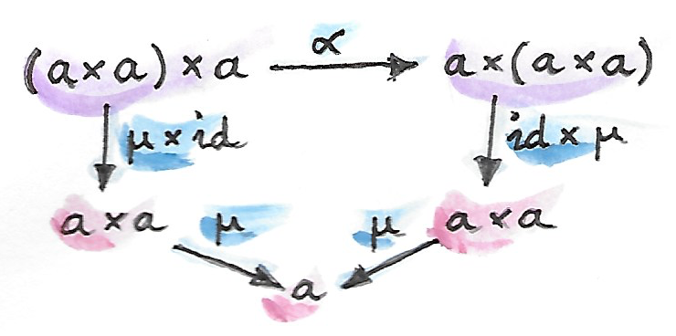
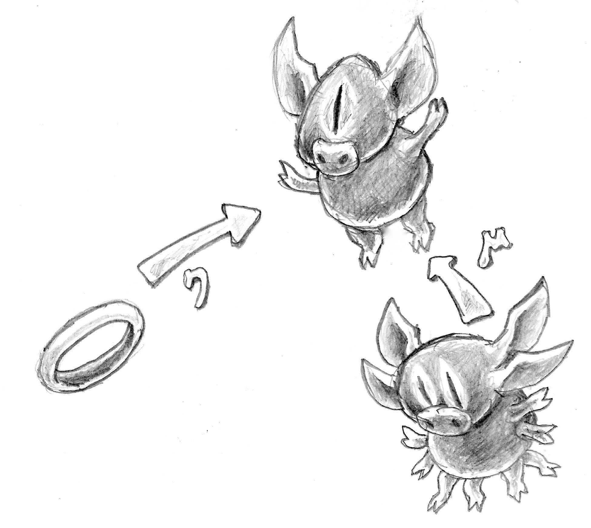
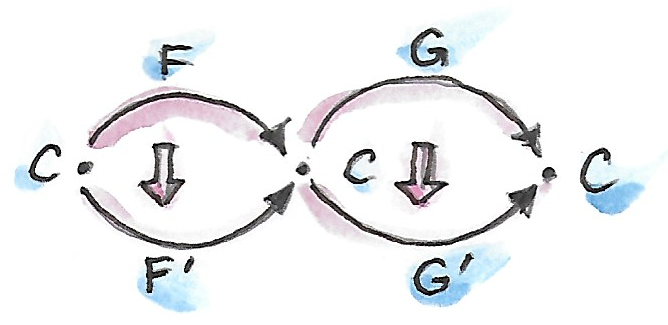

======================
 Monads Categorically
======================

If you mention monads to a programmer, you’ll probably end up talking
about effects. To a mathematician, monads are about algebras. We’ll talk
about algebras later — they play an important role in programming — but
first I’d like to give you a little intuition about their relation to
monads. For now, it’s a bit of a hand-waving argument, but bear with me.

Algebra is about creating, manipulating, and evaluating expressions.
Expressions are built using operators. Consider this simple expression:

::

    x2 + 2 x + 1

This expression is formed using variables like ``x``, and constants like
1 or 2, bound together with operators like plus or times. As
programmers, we often think of expressions as trees.

|exptree|

Trees are containers so, more generally, an expression is a container
for storing variables. In category theory, we represent containers as
endofunctors. If we assign the type ``a`` to the variable ``x``, our
expression will have the type ``m a``, where ``m`` is an endofunctor
that builds expression trees. (Nontrivial branching expressions are
usually created using recursively defined endofunctors.)

What’s the most common operation that can be performed on an expression?
It’s substitution: replacing variables with expressions. For instance,
in our example, we could replace ``x`` with ``y - 1`` to get:

::

    (y - 1)2 + 2 (y - 1) + 1

Here’s what happened: We took an expression of type ``m a`` and applied
a transformation of type ``a -> m b`` (``b`` represents the type of
``y``). The result is an expression of type ``m b``. Let me spell it
out:

.. code-block:: haskell

    m a -> (a -> m b) -> m b

Yes, that’s the signature of monadic bind.

That was a bit of motivation. Now let’s get to the math of the monad.
Mathematicians use different notation than programmers. They prefer to
use the letter ``T`` for the endofunctor, and Greek letters: μ for
``join`` and η for ``return``. Both ``join`` and ``return`` are
polymorphic functions, so we can guess that they correspond to natural
transformations.

Therefore, in category theory, a monad is defined as an endofunctor
``T`` equipped with a pair of natural transformations μ and η.

μ is a natural transformation from the square of the functor ``T2`` back
to ``T``. The square is simply the functor composed with itself,
``T ∘ T`` (we can only do this kind of squaring for endofunctors).

.. code-block:: haskell

    μ :: T2 -> T

The component of this natural transformation at an object ``a`` is the
morphism:

.. code-block:: haskell

    μa :: T (T a) -> T a

which, in *Hask*, translates directly to our definition of ``join``.

η is a natural transformation between the identity functor ``I`` and
``T``:

.. code-block:: haskell

    η :: I -> T

Considering that the action of ``I`` on the object ``a`` is just ``a``,
the component of η is given by the morphism:

.. code-block:: haskell

    ηa :: a -> T a

which translates directly to our definition of ``return``.

These natural transformations must satisfy some additional laws. One way
of looking at it is that these laws let us define a Kleisli category for
the endofunctor ``T``. Remember that a Kleisli arrow between ``a`` and
``b`` is defined as a morphism ``a -> T b``. The composition of two such
arrows (I’ll write it as a circle with the subscript ``T``) can be
implemented using μ:

.. code-block:: haskell

    g ∘T f = μc ∘ (T g) ∘ f

where

.. code-block:: haskell

    f :: a -> T b
    g :: b -> T c

Here ``T``, being a functor, can be applied to the morphism ``g``. It
might be easier to recognize this formula in Haskell notation:

.. code-block:: haskell

    f >=> g = join . fmap g . f

or, in components:

.. code-block:: haskell

    (f >=> g) a = join (fmap g (f a))

In terms of the algebraic interpretation, we are just composing two
successive substitutions.

For Kleisli arrows to form a category we want their composition to be
associative, and η\ :sub:`a` to be the identity Kleisli arrow at ``a``.
This requirement can be translated to monadic laws for μ and η. But
there is another way of deriving these laws that makes them look more
like monoid laws. In fact ``μ`` is often called multiplication, and
``η`` unit.

Roughly speaking, the associativity law states that the two ways of
reducing the cube of ``T``, ``T3``, down to ``T`` must give the same
result. Two unit laws (left and right) state that when ``η`` is applied
to ``T`` and then reduced by ``μ``, we get back ``T``.

Things are a little tricky because we are composing natural
transformations and functors. So a little refresher on horizontal
composition is in order. For instance, ``T3`` can be seen as a
composition of ``T`` after ``T2``. We can apply to it the horizontal
composition of two natural transformations:

.. code-block:: haskell

    IT ∘ μ

|assoc1|

and get ``T∘T``; which can be further reduced to ``T`` by applying
``μ``. ``IT`` is the identity natural transformation from ``T`` to
``T``. You will often see the notation for this type of horizontal
composition ``IT ∘ μ`` shortened to ``T∘μ``. This notation is
unambiguous because it makes no sense to compose a functor with a
natural transformation, therefore ``T`` must mean ``IT`` in this
context.

We can also draw the diagram in the (endo-) functor category ``[C, C]``:

|assoc2|

Alternatively, we can treat ``T3`` as the composition of ``T2∘T`` and
apply ``μ∘T`` to it. The result is also ``T∘T`` which, again, can be
reduced to ``T`` using μ. We require that the two paths produce the same
result.

|assoc|

Similarly, we can apply the horizontal composition ``η∘T`` to the
composition of the identity functor ``I`` after ``T`` to obtain ``T2``,
which can then be reduced using ``μ``. The result should be the same as
if we applied the identity natural transformation directly to ``T``.
And, by analogy, the same should be true for ``T∘η``.

|unitlawcomp-1|

You can convince yourself that these laws guarantee that the composition
of Kleisli arrows indeed satisfies the laws of a category.

The similarities between a monad and a monoid are striking. We have
multiplication μ, unit η, associativity, and unit laws. But our
definition of a monoid is too narrow to describe a monad as a monoid. So
let’s generalize the notion of a monoid.

Monoidal Categories
===================

Let’s go back to the conventional definition of a monoid. It’s a set
with a binary operation and a special element called unit. In Haskell,
this can be expressed as a typeclass:

.. code-block:: haskell

    class Monoid m where
        mappend :: m -> m -> m
        mempty  :: m

The binary operation ``mappend`` must be associative and unital (i.e.,
multiplication by the unit ``mempty`` is a no-op).

Notice that, in Haskell, the definition of ``mappend`` is curried. It
can be interpreted as mapping every element of ``m`` to a function:

.. code-block:: haskell

    mappend :: m -> (m -> m)

It’s this interpretation that gives rise to the definition of a monoid
as a single-object category where endomorphisms ``(m -> m)`` represent
the elements of the monoid. But because currying is built into Haskell,
we could as well have started with a different definition of
multiplication:

.. code-block:: haskell

    mu :: (m, m) -> m

Here, the cartesian product ``(m, m)`` becomes the source of pairs to be
multiplied.

This definition suggests a different path to generalization: replacing
the cartesian product with categorical product. We could start with a
category where products are globally defined, pick an object ``m``
there, and define multiplication as a morphism:

.. code-block:: haskell

    μ :: m × m -> m

We have one problem though: In an arbitrary category we can’t peek
inside an object, so how do we pick the unit element? There is a trick
to it. Remember how element selection is equivalent to a function from
the singleton set? In Haskell, we could replace the definition of
``mempty`` with a function:

.. code-block:: haskell

    eta :: () -> m

The singleton is the terminal object in **Set**, so it’s natural to
generalize this definition to any category that has a terminal object
``t``:

.. code-block:: haskell

    η :: t -> m

This lets us pick the unit “element” without having to talk about
elements.

Unlike in our previous definition of a monoid as a single-object
category, monoidal laws here are not automatically satisfied — we have
to impose them. But in order to formulate them we have to establish the
monoidal structure of the underlying categorical product itself. Let’s
recall how monoidal structure works in Haskell first.

We start with associativity. In Haskell, the corresponding equational
law is:

.. code-block:: haskell

    mu x (mu y z) = mu (mu x y) z

Before we can generalize it to other categories, we have to rewrite it
as an equality of functions (morphisms). We have to abstract it away
from its action on individual variables — in other words, we have to use
point-free notation. Knowning that the cartesian product is a bifunctor,
we can write the left hand side as:

.. code-block:: haskell

    (mu . bimap id mu)(x, (y, z))

and the right hand side as:

.. code-block:: haskell

    (mu . bimap mu id)((x, y), z)

This is almost what we want. Unfortunately, the cartesian product is not
strictly associative — ``(x, (y, z))`` is not the same as
``((x, y), z)`` — so we can’t just write point-free:

.. code-block:: haskell

    mu . bimap id mu = mu . bimap mu id

On the other hand, the two nestings of pairs are isomorphic. There is an
invertible function called the associator that converts between them:

.. code-block:: haskell

    alpha :: ((a, b), c) -> (a, (b, c))
    alpha ((x, y), z) = (x, (y, z))

With the help of the associator, we can write the point-free
associativity law for ``mu``:

.. code-block:: haskell

    mu . bimap id mu . alpha = mu . bimap mu id

We can apply a similar trick to unit laws which, in the new notation,
take the form:

.. code-block:: haskell

    mu (eta (), x) = x
    mu (x, eta ()) = x

They can be rewritten as:

.. code-block:: haskell

    (mu . bimap eta id) ((), x) = lambda ((), x)
    (mu . bimap id eta) (x, ()) = rho (x, ())

The isomorphisms ``lambda`` and ``rho`` are called the left and right
unitor, respectively. They witness the fact that the unit ``()`` is the
identity of the cartesian product up to isomorphism:

.. code-block:: haskell

    lambda :: ((), a) -> a
    lambda ((), x) = x

.. code-block:: haskell

    rho :: (a, ()) -> a
    rho (x, ()) = x

The point-free versions of the unit laws are therefore:

.. code-block:: haskell

    mu . bimap id eta = lambda
    mu . bimap eta id = rho

We have formulated point-free monoidal laws for ``mu`` and ``eta`` using
the fact that the underlying cartesian product itself acts like a
monoidal multiplication in the category of types. Keep in mind though
that the associativity and unit laws for the cartesian product are valid
only up to isomorphism.

It turns out that these laws can be generalized to any category with
products and a terminal object. Categorical products are indeed
associative up to isomorphism and the terminal object is the unit, also
up to isomorphism. The associator and the two unitors are natural
isomorphisms. The laws can be represented by commuting diagrams.

|assocmon|

Notice that, because the product is a bifunctor, it can lift a pair of
morphisms — in Haskell this was done using ``bimap``.

We could stop here and say that we can define a monoid on top of any
category with categorical products and a terminal object. As long as we
can pick an object ``m`` and two morphisms μ and η that satisfy monoidal
laws, we have a monoid. But we can do better than that. We don’t need a
full-blown categorical product to formulate the laws for μ and η. Recall
that a product is defined through a universal construction that uses
projections. We haven’t used any projections in our formulation of
monoidal laws.

A bifunctor that behaves like a product without being a product is
called a tensor product, often denoted by the infix operator ⊗. A
definition of a tensor product in general is a bit tricky, but we won’t
worry about it. We’ll just list its properties — the most important
being associativity up to isomorphism.

Similarly, we don’t need the object ``t`` to be terminal. We never used
its terminal property — namely, the existence of a unique morphism from
any object to it. What we require is that it works well in concert with
the tensor product. Which means that we want it to be the unit of the
tensor product, again, up to isomorphism. Let’s put it all together:

A monoidal category is a category *C* equipped with a bifunctor called
the tensor product:

.. code-block:: haskell

    ⊗ :: C × C -> C

and a distinct object ``i`` called the unit object, together with three
natural isomorphisms called, respectively, the associator and the left
and right unitors:

.. code-block:: haskell

    αa b c :: (a ⊗ b) ⊗ c -> a ⊗ (b ⊗ c)
    λa :: i ⊗ a -> a
    ρa :: a ⊗ i -> a

(There is also a coherence condition for simplifying a quadruple tensor
product.)

What’s important is that a tensor product describes many familiar
bifunctors. In particular, it works for a product, a coproduct and, as
we’ll see shortly, for the composition of endofunctors (and also for
some more esoteric products like Day convolution). Monoidal categories
will play an essential role in the formulation of enriched categories.

Monoid in a Monoidal Category
=============================

We are now ready to define a monoid in a more general setting of a
monoidal category. We start by picking an object ``m``. Using the tensor
product we can form powers of ``m``. The square of ``m`` is ``m ⊗ m``.
There are two ways of forming the cube of ``m``, but they are isomorphic
through the associator. Similarly for higher powers of ``m`` (that’s
where we need the coherence conditions). To form a monoid we need to
pick two morphisms:

.. code-block:: haskell

    μ :: m ⊗ m -> m
    η :: i -> m

where ``i`` is the unit object for our tensor product.

|monoid-1|

These morphisms have to satisfy associativity and unit laws, which can
be expressed in terms of the following commuting diagrams:

|assoctensor|

|unitmon|

Notice that it’s essential that the tensor product be a bifunctor
because we need to lift pairs of morphisms to form products such as
``μ ⊗ id`` or ``η ⊗ id``. These diagrams are just a straightforward
generalization of our previous results for categorical products.

Monads as Monoids
=================

Monoidal structures pop up in unexpected places. One such place is the
functor category. If you squint a little, you might be able to see
functor composition as a form of multiplication. The problem is that not
any two functors can be composed — the target category of one has to be
the source category of the other. That’s just the usual rule of
composition of morphisms — and, as we know, functors are indeed
morphisms in the category **Cat**. But just like endomorphisms
(morphisms that loop back to the same object) are always composable, so
are endofunctors. For any given category *C*, endofunctors from *C* to
*C* form the functor category ``[C, C]``. Its objects are endofunctors,
and morphisms are natural transformations between them. We can take any
two objects from this category, say endofunctors ``F`` and ``G``, and
produce a third object ``F ∘ G`` — an endofunctor that’s their
composition.

Is endofunctor composition a good candidate for a tensor product? First,
we have to establish that it’s a bifunctor. Can it be used to lift a
pair of morphisms — here, natural transformations? The signature of the
analog of ``bimap`` for the tensor product would look something like
this:

.. code-block:: haskell

    bimap :: (a -> b) -> (c -> d) -> (a ⊗ c -> b ⊗ d)

If you replace objects by endofunctors, arrows by natural
transformations, and tensor products by composition, you get:

.. code-block:: haskell

    (F -> F') -> (G -> G') -> (F ∘ G -> F' ∘ G')

which you may recognize as the special case of horizontal composition.

|horizcomp|

We also have at our disposal the identity endofunctor ``I``, which can
serve as the identity for endofunctor composition — our new tensor
product. Moreover, functor composition is associative. In fact
associativity and unit laws are strict — there’s no need for the
associator or the two unitors. So endofunctors form a strict monoidal
category with functor composition as tensor product.

What’s a monoid in this category? It’s an object — that is an
endofunctor ``T``; and two morphisms — that is natural transformations:

.. code-block:: haskell

    μ :: T ∘ T -> T
    η :: I -> T

Not only that, here are the monoid laws:

|assoc|

|unitlawcomp|

They are exactly the monad laws we’ve seen before. Now you understand
the famous quote from Saunders Mac Lane:

All told, monad is just a monoid in the category of endofunctors.

You might have seen it emblazoned on some t-shirts at functional
programming conferences.

Monads from Adjunctions
=======================

An `adjunction <https://bartoszmilewski.com/2016/04/18/adjunctions/>`__,
``L ⊣ R``, is a pair of functors going back and forth between two
categories *C* and *D*. There are two ways of composing them giving rise
to two endofunctors, ``R ∘ L`` and ``L ∘ R``. As per an adjunction,
these endofunctors are related to identity functors through two natural
transformations called unit and counit:

.. code-block:: haskell

    η :: ID -> R ∘ L
    ε :: L ∘ R -> IC

Immediately we see that the unit of an adjunction looks just like the
unit of a monad. It turns out that the endofunctor ``R ∘ L`` is indeed a
monad. All we need is to define the appropriate μ to go with the η.
That’s a natural transformation between the square of our endofunctor
and the endofunctor itself or, in terms of the adjoint functors:

.. code-block:: haskell

    R ∘ L ∘ R ∘ L -> R ∘ L

And, indeed, we can use the counit to collapse the ``L ∘ R`` in the
middle. The exact formula for μ is given by the horizontal composition:

.. code-block:: haskell

    μ = R ∘ ε ∘ L

Monadic laws follow from the identities satisfied by the unit and counit
of the adjunction and the interchange law.

We don’t see a lot of monads derived from adjunctions in Haskell,
because an adjunction usually involves two categories. However, the
definitions of an exponential, or a function object, is an exception.
Here are the two endofunctors that form this adjunction:

.. code-block:: haskell

    L z = z × s
    R b = s ⇒ b

You may recognize their composition as the familiar state monad:

.. code-block:: haskell

    R (L z) = s ⇒ (z × s)

We’ve seen this monad before in Haskell:

.. code-block:: haskell

    newtype State s a = State (s -> (a, s))

Let’s also translate the adjunction to Haskell. The left functor is the
product functor:

.. code-block:: haskell

    newtype Prod s a = Prod (a, s)

and the right functor is the reader functor:

.. code-block:: haskell

    newtype Reader s a = Reader (s -> a)

They form the adjunction:

.. code-block:: haskell

    instance Adjunction (Prod s) (Reader s) where
      counit (Prod (Reader f, s)) = f s
      unit a = Reader (\s -> Prod (a, s))

You can easily convince yourself that the composition of the reader
functor after the product functor is indeed equivalent to the state
functor:

.. code-block:: haskell

    newtype State s a = State (s -> (a, s))

As expected, the ``unit`` of the adjunction is equivalent to the
``return`` function of the state monad. The ``counit`` acts by
evaluating a function acting on its argument. This is recognizable as
the uncurried version of the function ``runState``:

.. code-block:: haskell

    runState :: State s a -> s -> (a, s)
    runState (State f) s = f s

(uncurried, because in ``counit`` it acts on a pair).

We can now define ``join`` for the state monad as a component of the
natural transformation μ. For that we need a horizontal composition of
three natural transformations:

.. code-block:: haskell

    μ = R ∘ ε ∘ L

In other words, we need to sneak the counit ε across one level of the
reader functor. We can’t just call ``fmap`` directly, because the
compiler would pick the one for the ``State`` functor, rather than the
``Reader`` functor. But recall that ``fmap`` for the reader functor is
just left function composition. So we’ll use function composition
directly.

We have to first peel off the data constructor ``State`` to expose the
function inside the ``State`` functor. This is done using ``runState``:

.. code-block:: haskell

    ssa :: State s (State s a)
    runState ssa :: s -> (State s a, s)

Then we left-compose it with the counit, which is defined by
``uncurry runState``. Finally, we clothe it back in the ``State`` data
constructor:

.. code-block:: haskell

    join :: State s (State s a) -> State s a
    join ssa = State (uncurry runState . runState ssa)

This is indeed the implementation of ``join`` for the ``State`` monad.

It turns out that not only every adjunction gives rise to a monad, but
the converse is also true: every monad can be factorized into a
composition of two adjoint functors. Such factorization is not unique
though.

We’ll talk about the other endofunctor ``L ∘ R`` in the next section.

.. |exptree| image:: ../images/2016/12/exptree.png
   :class: alignnone wp-image-8000
   :width: 175px
   :height: 180px
   :target: ../images/2016/12/exptree.png
.. |assoc1| image:: ../images/2016/12/assoc1.png
   :class: alignnone wp-image-7996
   :width: 248px
   :height: 151px
   :target: ../images/2016/12/assoc1.png
.. |assoc2| image:: ../images/2016/12/assoc2.png
   :class: alignnone wp-image-7997
   :width: 167px
   :height: 149px
   :target: ../images/2016/12/assoc2.png
.. |assoc| image:: ../images/2016/12/assoc.png
   :class: alignnone wp-image-7995
   :width: 208px
   :height: 165px
   :target: ../images/2016/12/assoc.png
.. |unitlawcomp-1| image:: ../images/2016/12/unitlawcomp-1.png
   :class: alignnone size-medium wp-image-8002
   :width: 300px
   :height: 124px
   :target: ../images/2016/12/unitlawcomp-1.png

.. |assoctensor| image:: ../images/2016/12/assoctensor.jpg
   :class: alignnone size-medium wp-image-8065
   :width: 300px
   :height: 145px
   :target: ../images/2016/12/assoctensor.jpg
.. |unitmon| image:: ../images/2016/12/unitmon.jpg
   :class: alignnone size-medium wp-image-8038
   :width: 300px
   :height: 121px
   :target: ../images/2016/12/unitmon.jpg

.. |assoc| image:: ../images/2016/12/assoc.png
   :class: alignnone wp-image-7995
   :width: 183px
   :height: 145px
   :target: ../images/2016/12/assoc.png
.. |unitlawcomp| image:: ../images/2016/12/unitlawcomp.png
   :class: wp-image-8003 alignnone
   :width: 275px
   :height: 121px
   :target: ../images/2016/12/unitlawcomp.png
