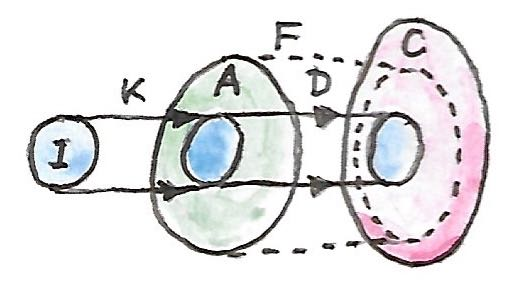

================
 Kan Extensions
================

So far we’ve been mostly working with a single category or a pair of
categories. In some cases that was a little too constraining. For
instance, when defining a limit in a category *C*, we introduced an
index category ``I`` as the template for the pattern that would form the
basis for our cones. It would have made sense to introduce another
category, a trivial one, to serve as a template for the apex of the
cone. Instead we used the constant functor ``Δc`` from ``I`` to ``C``.

It’s time to fix this awkwardness. Let’s define a limit using three
categories. Let’s start with the functor ``D`` from the index category
*I* to *C*. This is the functor that selects the base of the cone — the
diagram functor.

|image0|

The new addition is the category **1** that contains a single object
(and a single identity morphism). There is only one possible functor
``K`` from *I* to this category. It maps all objects to the only object
in **1**, and all morphisms to the identity morphism. Any functor ``F``
from **1** to *C* picks a potential apex for our cone.

|image1|

A cone is a natural transformation ``ε`` from ``F ∘ K`` to ``D``. Notice
that ``F ∘ K`` does exactly the same thing as our original ``Δc``. The
following diagram shows this transformation.

|image2|

We can now define a universal property that picks the “best” such
functor ``F``. This ``F`` will map **1** to the object that is the limit
of ``D`` in *C*, and the natural transformation ``ε`` from ``F ∘ K`` to
``D`` will provide the corresponding projections. This universal functor
is called the right Kan extension of ``D`` along ``K`` and is denoted by
``RanKD``.

Let’s formulate the universal property. Suppose we have another cone —
that is another functor ``F'`` together with a natural transformation
``ε'`` from ``F' ∘ K`` to ``D``.

|image3|

If the Kan extension ``F = RanKD`` exists, there must be a unique
natural transformation ``σ`` from ``F'`` to it, such that ``ε'``
factorizes through ``ε``, that is:

.. code-block:: haskell

    ε' = ε . (σ ∘ K)

Here, ``σ ∘ K`` is the horizontal composition of two natural
transformations (one of them being the identity natural transformation
on ``K``). This transformation is then vertically composed with ``ε``.

|image4|

In components, when acting on an object ``i`` in *I*, we get:

.. code-block:: haskell

    ε'i = εi ∘ σ K i

In our case, ``σ`` has only one component corresponding to the single
object of **1**. So, indeed, this is the unique morphism from the apex
of the cone defined by ``F'`` to the apex of the universal cone defined
by ``RanKD``. The commuting conditions are exactly the ones required by
the definition of a limit.

But, importantly, we are free to replace the trivial category **1** with
an arbitrary category *A*, and the definition of the right Kan extension
remains valid.

Right Kan Extension
===================

The right Kan extension of the functor ``D::I->C`` along the functor
``K::I->A`` is a functor ``F::A->C`` (denoted ``RanKD``) together with a
natural transformation

.. code-block:: haskell

    ε :: F ∘ K -> D

such that for any other functor ``F'::A->C`` and a natural
transformation

.. code-block:: haskell

    ε' :: F' ∘ K -> D

there is a unique natural transformation

.. code-block:: haskell

    σ :: F' -> F

that factorizes ``ε'``:

.. code-block:: haskell

    ε' = ε . (σ ∘ K)

This is quite a mouthful, but it can be visualized in this nice diagram:

|image5|

An interesting way of looking at this is to notice that, in a sense, the
Kan extension acts like the inverse of “functor multiplication.” Some
authors go as far as use the notation ``D/K`` for ``RanKD``. Indeed, in
this notation, the definition of ``ε``, which is also called the counit
of the right Kan extension, looks like simple cancellation:

.. code-block:: haskell

    ε :: D/K ∘ K -> D

There is another interpretation of Kan extensions. Consider that the
functor ``K`` embeds the category *I* inside *A*. In the simplest case
*I* could just be a subcategory of *A*. We have a functor ``D`` that
maps *I* to *C*. Can we extend ``D`` to a functor ``F`` that is defined
on the whole of *A*? Ideally, such an extension would make the
composition ``F ∘ K`` be isomorphic to ``D``. In other words, ``F``
would be extending the domain of ``D`` to ``A``. But a full-blown
isomorphism is usually too much to ask, and we can do with just half of
it, namely a one-way natural transformation ``ε`` from ``F ∘ K`` to
``D``. (The left Kan extension picks the other direction.)

| |image6|
| Of course, the embedding picture breaks down when the functor ``K`` is
  not injective on objects or not faithful on hom-sets, as in the
  example of the limit. In that case, the Kan extension tries its best
  to extrapolate the lost information.

Kan Extension as Adjunction
===========================

Now suppose that the right Kan extension exists for any ``D`` (and a
fixed ``K``). In that case ``RanK -`` (with the dash replacing ``D``) is
a functor from the functor category ``[I, C]`` to the functor category
``[A, C]``. It turns out that this functor is the right adjoint to the
precomposition functor ``-∘K``. The latter maps functors in ``[A, C]``
to functors in ``[I, C]``. The adjunction is:

.. code-block:: haskell

    [I, C](F' ∘ K, D) ≅ [A, C](F', RanKD)

It is just a restatement of the fact that to every natural
transformation we called ``ε'`` corresponds a unique natural
transformation we called ``σ``.

|image7|

Furthermore, if we chose the category *I* to be the same as *C*, we can
substitute the identity functor ``IC`` for ``D``. We get the following
identity:

.. code-block:: haskell

    [C, C](F' ∘ K, IC) ≅ [A, C](F', RanKIC)

We can now chose ``F'`` to be the same as ``RanKIC``. In that case the
right hand side contains the identity natural transformation and,
corresponding to it, the left hand side gives us the following natural
transformation:

.. code-block:: haskell

    ε :: RanKIC ∘ K -> IC

This looks very much like the counit of an adjunction:

.. code-block:: haskell

    RanKIC ⊣ K

Indeed, the right Kan extension of the identity functor along a functor
``K`` can be used to calculate the left adjoint of ``K``. For that, one
more condition is necessary: the right Kan extension must be preserved
by the functor ``K``. The preservation of the extension means that, if
we calculate the Kan extension of the functor precomposed with ``K``, we
should get the same result as precomposing the original Kan extesion
with ``K``. In our case, this condition simplifies to:

.. code-block:: haskell

    K ∘ RanKIC ≅ RanKK

Notice that, using the division-by-K notation, the adjunction can be
written as:

.. code-block:: haskell

    I/K ⊣ K

which confirms our intuition that an adjunction describes some kind of
an inverse. The preservation condition becomes:

.. code-block:: haskell

    K ∘ I/K ≅ K/K

The right Kan extension of a functor along itself, ``K/K``, is called a
codensity monad.

The adjunction formula is an important result because, as we’ll see
soon, we can calculate Kan extensions using ends (coends), thus giving
us practical means of finding right (and left) adjoints.

Left Kan Extension
==================
   :name: left-kan-extension

There is a dual construction that gives us the left Kan extension. To
build some intuition, we’ll can start with the definition of a colimit
and restructure it to use the singleton category **1**. We build a
cocone by using the functor ``D::I->C`` to form its base, and the
functor ``F::1->C`` to select its apex.

|image8|

The sides of the cocone, the injections, are components of a natural
transformation ``η`` from ``D`` to ``F ∘ K``.

|image9|

The colimit is the universal cocone. So for any other functor ``F'`` and
a natural transformation

.. code-block:: haskell

    η' :: D -> F'∘ K

|image10|

there is a unique natural transformation ``σ`` from ``F`` to ``F'``

|image11|

such that:

.. code-block:: haskell

    η' = (σ ∘ K) . η

| This is illustrated in the following diagram:
| |image12|

| Replacing the singleton category **1** with *A*, this definition
  naturally generalized to the definition of the left Kan extension,
  denoted by ``LanKD``.
| |image13|
| The natural transformation:

.. code-block:: haskell

    η :: D -> LanKD ∘ K

is called the unit of the left Kan extension.

As before, we can recast the one-to-one correspondence between natural
transformations:

.. code-block:: haskell

    η' = (σ ∘ K) . η

in terms of the adjunction:

.. code-block:: haskell

    [A, C](LanKD, F') ≅ [I, C](D, F' ∘ K)

In other words, the left Kan extension is the left adjoint, and the
right Kan extension is the right adjoint of the postcomposition with
``K``.

Just like the right Kan extension of the identity functor could be used
to calculate the left adjoint of ``K``, the left Kan extension of the
identity functor turns out to be the right adjoint of ``K`` (with ``η``
being the unit of the adjunction):

.. code-block:: haskell

    K ⊣ LanKIC

Combining the two results, we get:

.. code-block:: haskell

    RanKIC ⊣ K ⊣ LanKIC

Kan Extensions as Ends
======================

The real power of Kan extensions comes from the fact that they can be
calculated using ends (and coends). For simplicity, we’ll restrict our
attention to the case where the target category *C* is **Set**, but the
formulas can be extended to any category.

Let’s revisit the idea that a Kan extension can be used to extend the
action of a functor outside of its original domain. Suppose that ``K``
embeds *I* inside *A*. Functor ``D`` maps *I* to **Set**. We could just
say that for any object ``a`` in the image of ``K``, that is
``a = K i``, the extended functor maps ``a`` to ``D i``. The problem is,
what to do with those objects in *A* that are outside of the image of
``K``? The idea is that every such object is potentially connected
through lots of morphisms to every object in the image of ``K``. A
functor must preserve these morphisms. The totality of morphisms from an
object ``a`` to the image of ``K`` is characterized by the hom-functor:

.. code-block:: haskell

    A(a, K -)

| |image14|
| Notice that this hom-functor is a composition of two functors:

.. code-block:: haskell

    A(a, K -) = A(a, -) ∘ K

The right Kan extension is the right adjoint of functor composition:

.. code-block:: haskell

    [I, Set](F' ∘ K, D) ≅ [A, Set](F', RanKD)

Let’s see what happens when we replace ``F'`` with the hom functor:

.. code-block:: haskell

    [I, Set](A(a, -) ∘ K, D) ≅ [A, Set](A(a, -), RanKD)

and then inline the composition:

.. code-block:: haskell

    [I, Set](A(a, K -), D) ≅ [A, Set](A(a, -), RanKD)

The right hand side can be reduced using the Yoneda lemma:

.. code-block:: haskell

    [I, Set](A(a, K -), D) ≅ RanKD a

We can now rewrite the set of natural transformations as the end to get
this very convenient formula for the right Kan extension:

.. code-block:: haskell

    RanKD a ≅ ∫i Set(A(a, K i), D i)

There is an analogous formula for the left Kan extension in terms of a
coend:

.. code-block:: haskell

    LanKD a = ∫i A(K i, a) × D i

To see that this is the case, we’ll show that this is indeed the left
adjoint to functor composition:

.. code-block:: haskell

    [A, Set](LanKD, F') ≅ [I, Set](D, F'∘ K)

Let’s substitute our formula in the left hand side:

.. code-block:: haskell

    [A, Set](∫i A(K i, -) × D i, F')

This is a set of natural transformations, so it can be rewritten as an
end:

.. code-block:: haskell

    ∫a Set(∫i A(K i, a) × D i, F'a)

Using the continuity of the hom-functor, we can replace the coend with
the end:

.. code-block:: haskell

    ∫a ∫i Set(A(K i, a) × D i, F'a)

We can use the product-exponential adjunction:

.. code-block:: haskell

    ∫a ∫i Set(A(K i, a), (F'a)D i)

The exponential is isomorphic to the corresponding hom-set:

.. code-block:: haskell

    ∫a ∫i Set(A(K i, a), A(D i, F'a))

There is a theorem called the Fubini theorem that allows us to swap the
two ends:

.. code-block:: haskell

    ∫i ∫a Set(A(K i, a), A(D i, F'a))

The inner end represents the set of natural transformations between two
functors, so we can use the Yoneda lemma:

.. code-block:: haskell

    ∫i A(D i, F'(K i))

This is indeed the set of natural transformations that forms the right
hand side of the adjunction we set out to prove:

.. code-block:: haskell

    [I, Set](D, F'∘ K)

These kinds of calculations using ends, coends, and the Yoneda lemma are
pretty typical for the “calculus” of ends.

Kan Extensions in Haskell
=========================

The end/coend formulas for Kan extensions can be easily translated to
Haskell. Let’s start with the right extension:

.. code-block:: haskell

    RanKD a ≅ ∫i Set(A(a, K i), D i)

We replace the end with the universal quantifier, and hom-sets with
function types:

.. code-block:: haskell

    newtype Ran k d a = Ran (forall i. (a -> k i) -> d i)

Looking at this definition, it’s clear that ``Ran`` must contain a value
of type ``a`` to which the function can be applied, and a natural
transformation between the two functors ``k`` and ``d``. For instance,
suppose that ``k`` is the tree functor, and ``d`` is the list functor,
and you were given a ``Ran Tree [] String``. If you pass it a function:

.. code-block:: haskell

    f :: String -> Tree Int

you’ll get back a list of ``Int``, and so on. The right Kan extension
will use your function to produce a tree and then repackage it into a
list. For instance, you may pass it a parser that generates a parsing
tree from a string, and you’ll get a list that corresponds to the
depth-first traversal of this tree.

The right Kan extension can be used to calculate the left adjoint of a
given functor by replacing the functor ``d`` with the identity functor.
This leads to the left adjoint of a functor ``k`` being represented by
the set of polymorphic functions of the type:

.. code-block:: haskell

    forall i. (a -> k i) -> i

Suppose that ``k`` is the forgetful functor from the category of
monoids. The universal quantifier then goes over all monoids. Of course,
in Haskell we cannot express monoidal laws, but the following is a
decent approximation of the resulting free functor (the forgetful
functor ``k`` is an identity on objects):

.. code-block:: haskell

    type Lst a = forall i. Monoid i => (a -> i) -> i

As expected, it generates free monoids, or Haskell lists:

.. code-block:: haskell

    toLst :: [a] -> Lst a
    toLst as = \f -> foldMap f as

    fromLst :: Lst a -> [a]
    fromLst f = f (\a -> [a])

The left Kan extension is a coend:

.. code-block:: haskell

    LanKD a = ∫i A(K i, a) × D i

so it translates to an existential quantifier. Symbolically:

.. code-block:: haskell

    Lan k d a = exists i. (k i -> a, d i)

This can be encoded in Haskell using GADTs, or using a universally
quantified data constructor:

.. code-block:: haskell

    data Lan k d a = forall i. Lan (k i -> a) (d i)

The interpretation of this data structure is that it contains a function
that takes a container of some unspecified ``i``\ s and produces an
``a``. It also has a container of those ``i``\ s. Since you have no idea
what ``i``\ s are, the only thing you can do with this data structure is
to retrieve the container of ``i``\ s, repack it into the container
defined by the functor ``k`` using a natural transformation, and call
the function to obtain the ``a``. For instance, if ``d`` is a tree, and
``k`` is a list, you can serialize the tree, call the function with the
resulting list, and obtain an ``a``.

The left Kan extension can be used to calculate the right adjoint of a
functor. We know that the right adjoint of the product functor is the
exponential, so let’s try to implement it using the Kan extension:

.. code-block:: haskell

    type Exp a b = Lan ((,) a) I b

This is indeed isomorphic to the function type, as witnessed by the
following pair of functions:

.. code-block:: haskell

    toExp :: (a -> b) -> Exp a b
    toExp f = Lan (f . fst) (I ())

    fromExp :: Exp a b -> (a -> b)
    fromExp (Lan f (I x)) = \a -> f (a, x)

Notice that, as described earlier in the general case, we performed the
following steps: (1) retrieved the container of ``x`` (here, it’s just a
trivial identity container), and the function ``f``, (2) repackaged the
container using the natural transformation between the identity functor
and the pair functor, and (3) called the function ``f``.

Free Functor
============

An interesting application of Kan extensions is the construction of a
free functor. It’s the solution to the following practical problem:
suppose you have a type constructor — that is a mapping of objects. Is
it possible to define a functor based on this type constructor? In other
words, can we define a mapping of morphisms that would extend this type
constructor to a full-blown endofunctor?

The key observation is that a type constructor can be described as a
functor whose domain is a discrete category. A discrete category has no
morphisms other than the identity morphisms. Given a category *C*, we
can always construct a discrete category *\|C\|* by simply discarding
all non-identity morphisms. A functor ``F`` from *\|C\|* to *C* is then
a simple mapping of objects, or what we call a type constructor in
Haskell. There is also a canonical functor ``J`` that injects *\|C\|*
into *C*: it’s an identity on objects (and on identity morphisms). The
left Kan extension of ``F`` along ``J``, if it exists, is then a functor
for *C* to *C*:

.. code-block:: haskell

    LanJ F a = ∫i C(J i, a) × F i

It’s called a free functor based on ``F``.

In Haskell, we would write it as:

.. code-block:: haskell

    data FreeF f a = forall i. FMap (i -> a) (f i)

Indeed, for any type constructor ``f``, ``FreeF f`` is a functor:

.. code-block:: haskell

    instance Functor (FreeF f) where
      fmap g (FMap h fi) = FMap (g . h) fi

As you can see, the free functor fakes the lifting of a function by
recording both the function and its argument. It accumulates the lifted
functions by recording their composition. Functor rules are
automatically satisfied. This construction was used in a paper `Freer
Monads, More Extensible
Effects <http://okmij.org/ftp/Haskell/extensible/more.pdf>`__.

Alternatively, we can use the right Kan extension for the same purpose:

.. code-block:: haskell

    newtype FreeF f a = FreeF (forall i. (a -> i) -> f i)

It’s easy to check that this is indeed a functor:

.. code-block:: haskell

    instance Functor (FreeF f) where
      fmap g (FreeF r) = FreeF (\bi -> r (bi . g))

.. |image0| image:: ../images/2017/04/kan2.jpg
   :class: alignnone wp-image-8641
   :width: 164px
   :height: 141px
   :target: ../images/2017/04/kan2.jpg

.. |image2| image:: ../images/2017/04/kan3-e1492120491591.jpg
   :class: alignnone wp-image-8642
   :width: 222px
   :height: 150px
   :target: ../images/2017/04/kan3-e1492120491591.jpg
.. |image3| image:: ../images/2017/04/kan31-e1492120512209.jpg
   :class: alignnone wp-image-8663
   :width: 227px
   :height: 165px
   :target: ../images/2017/04/kan31-e1492120512209.jpg
.. |image4| image:: ../images/2017/04/kan5.jpg
   :class: alignnone wp-image-8644
   :width: 237px
   :height: 178px
   :target: ../images/2017/04/kan5.jpg

.. |image9| image:: ../images/2017/04/kan10a.jpg
   :class: alignnone wp-image-8679
   :width: 224px
   :height: 117px
   :target: ../images/2017/04/kan10a.jpg
.. |image10| image:: ../images/2017/04/kan10b.jpg
   :class: alignnone wp-image-8680
   :width: 231px
   :height: 120px
   :target: ../images/2017/04/kan10b.jpg
.. |image11| image:: ../images/2017/04/kan14.jpg
   :class: alignnone wp-image-8656
   :width: 200px
   :height: 161px
   :target: ../images/2017/04/kan14.jpg
.. |image12| image:: ../images/2017/04/kan112.jpg
   :class: alignnone wp-image-8681
   :width: 211px
   :height: 164px
   :target: ../images/2017/04/kan112.jpg
.. |image13| image:: ../images/2017/04/kan12.jpg
   :class: alignnone wp-image-8651
   :width: 198px
   :height: 159px
   :target: ../images/2017/04/kan12.jpg
.. |image14| image:: ../images/2017/04/kan13.jpg
   :class: alignnone size-medium wp-image-8652
   :width: 300px
   :height: 183px
   :target: ../images/2017/04/kan13.jpg
