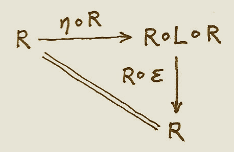

================
18 - Adjunctions
================

In mathematics we have various ways of saying that one thing is like
another. The strictest is equality. Two things are equal if there is no
way to distinguish one from another. One can be substituted for the
other in every imaginable context. For instance, did you notice that we
used *equality* of morphisms every time we talked about commuting
diagrams? That’s because morphisms form a set (hom-set) and set elements
can be compared for equality.

But equality is often too strong. There are many examples of things
being the same for all intents and purposes, without actually being
equal. For instance, the pair type ``(Bool, Char)`` is not strictly
equal to ``(Char, Bool)``, but we understand that they contain the same
information. This concept is best captured by an *isomorphism* between
two types — a morphism that’s invertible. Since it’s a morphism, it
preserves the structure; and being “iso” means that it’s part of a round
trip that lands you in the same spot, no matter on which side you start.
In the case of pairs, this isomorphism is called ``swap``:

.. code-block:: haskell

    swap       :: (a,b) -> (b,a)
    swap (a,b) = (b,a)

``swap`` happens to be its own inverse.

Adjunction and Unit/Counit Pair
   :name: adjunction-and-unitcounit-pair

When we talk about categories being isomorphic, we express this in terms
of mappings between categories, a.k.a. functors. We would like to be
able to say that two categories *C* and *D* are isomorphic if there
exists a functor ``R`` (“right”) from *C* to *D*, which is invertible.
In other words, there exists another functor ``L`` (“left”) from *D*
back to *C* which, when composed with ``R``, is equal to the identity
functor ``I``. There are two possible compositions, ``R ∘ L`` and
``L ∘ R``; and two possible identity functors: one in *C* and another in
*D*.

|Adj - 1|

But here’s the tricky part: What does it mean for two functors to be
*equal*? What do we mean by this equality:

::

    R ∘ L = ID

or this one:

::

    L ∘ R = IC

It would be reasonable to define functor equality in terms of equality
of objects. Two functors, when acting on equal objects, should produce
equal objects. But we don’t, in general, have the notion of object
equality in an arbitrary category. It’s just not part of the definition.
(Going deeper into this rabbit hole of “what equality really is,” we
would end up in Homotopy Type Theory.)

You might argue that functors *are* morphisms in the category of
categories, so they should be equality-comparable. And indeed, as long
as we are talking about small categories, where objects form a set, we
can indeed use the equality of elements of a set to equality-compare
objects.

But, remember, **Cat** is really a 2-category. Hom-sets in a 2-category
have additional structure — there are 2-morphisms acting between
1-morphisms. In **Cat**, 1-morphisms are functors, and 2-morphisms are
natural transformations. So it’s more natural (can’t avoid this pun!) to
consider natural isomorphisms as substitutes for equality when talking
about functors.

So, instead of isomorphism of categories, it makes sense to consider a
more general notion of *equivalence*. Two categories *C* and *D* are
*equivalent* if we can find two functors going back and forth between
them, whose composition (either way) is *naturally isomorphic* to the
identity functor. In other words, there is a two-way natural
transformation between the composition ``R ∘ L`` and the identity
functor ``ID``, and another between ``L ∘ R`` and the identity functor
``IC``.

Adjunction is even weaker than equivalence, because it doesn’t require
that the composition of the two functors be *isomorphic* to the identity
functor. Instead it stipulates the existence of a *one way* natural
transformation from ``ID`` to ``R∘L``, and another from ``L∘R`` to
``IC``. Here are the signatures of these two natural transformations:

::

    η :: ID -> R ∘ L
    ε :: L ∘ R -> IC

η is called the unit, and ε the counit of the adjunction.

Notice the asymmetry between these two definitions. In general, we don’t
have the two remaining mappings:

::

    R ∘ L -> ID -- not necessarily
    IC -> L ∘ R -- not necessarily

Because of this asymmetry, the functor ``L`` is called the *left
adjoint* to the functor ``R``, while the functor ``R`` is the right
adjoint to ``L``. (Of course, left and right make sense only if you draw
your diagrams one particular way.)

The compact notation for the adjunction is:

::

    L ⊣ R

To better understand the adjunction, let’s analyze the unit and the
counit in more detail.

|Adj-Unit|

Let’s start with the unit. It’s a natural transformation, so it’s a
family of morphisms. Given an object ``d`` in *D*, the component of η is
a morphism between ``I d``, which is equal to ``d``, and ``(R ∘ L) d``;
which, in the picture, is called ``d'``:

::

    ηd :: d -> (R ∘ L) d

Notice that the composition ``R∘L`` is an endofunctor in *D*.

This equation tells us that we can pick any object ``d`` in *D* as our
starting point, and use the round trip functor ``R ∘ L`` to pick our
target object ``d'``. Then we shoot an arrow — the morphism ``ηd`` — to
our target.

|Adj-Counit|

By the same token, the component of of the counit ε can be described as:

::

    εc' :: (L ∘ R) c -> c

where ``c'`` is ``(L ∘ R) c``. It tells us that we can pick any object
``c`` in *C* as our target, and use the round trip functor ``L ∘ R`` to
pick the source ``c'``. Then we shoot the arrow — the morphism ``εc'`` —
from the source to the target.

Another way of looking at unit and counit is that unit lets us
*introduce* the composition ``R ∘ L`` anywhere we could insert an
identity functor on *D*; and counit lets us *eliminate* the composition
``L ∘ R``, replacing it with the identity on *C*. That leads to some
“obvious” consistency conditions, which make sure that introduction
followed by elimination doesn’t change anything:

::

    L = L ∘ ID -> L ∘ R ∘ L -> IC ∘ L  = L

::

    R = ID ∘ R -> R ∘ L ∘ R -> R ∘ IC = R

These are called triangular identities because they make the following
diagrams commute:

|triangles|

| |triangles-2|
| These are diagrams in the functor category: the arrows are natural
  transformations, and their composition is the horizontal composition
  of natural transformations. In components, these identities become:

::

    ε L d ∘ L η d = id L d
    R ε c ∘ η R c = id R c

We often see unit and counit in Haskell under different names. Unit is
known as ``return`` (or ``pure``, in the definition of ``Applicative``):

.. code-block:: haskell

    return :: d -> m d

and counint as ``extract``:

.. code-block:: haskell

    extract :: w c -> c

Here, ``m`` is the (endo-) functor corresponding to ``R∘L``, and ``w``
is the (endo-) functor corresponding to ``L∘R``. As we’ll see later,
they are part of the definition of a monad and a comonad, respectively.

If you think of an endofunctor as a container, the unit (or ``return``)
is a polymorphic function that creates a default box around a value of
arbitrary type. The counit (or ``extract``) does the reverse: it
retrieves or produces a single value from a container.

We’ll see later that every pair of adjoint functors defines a monad and
a comonad. Conversely, every monad or comonad may be factorized into a
pair of adjoint functors — this factorization is not unique, though.

In Haskell, we use monads a lot, but only rarely factorize them into
pairs of adjoint functors, primarily because those functors would
normally take us out of **Hask**.

We can however define adjunctions of *endofunctors* in Haskell. Here’s
part of the definition taken from ``Data.Functor.Adjunction``:

.. code-block:: haskell

    class (Functor f, Representable u) =>
          Adjunction f u | f -> u, u -> f where
      unit         :: a -> u (f a)
      counit       :: f (u a) -> a

This definition requires some explanation. First of all, it describes a
multi-parameter type class — the two parameters being ``f`` and ``u``.
It establishes a relation called ``Adjunction`` between these two type
constructors.

Additional conditions, after the vertical bar, specify functional
dependencies. For instance, ``f -> u`` means that ``u`` is determined by
``f`` (the relation between ``f`` and ``u`` is a function, here on type
constructors). Conversely, ``u -> f`` means that, if we know ``u``, then
``f`` is uniquely determined.

I’ll explain in a moment why, in Haskell, we can impose the condition
that the right adjoint ``u`` be a *representable* functor.

Adjunctions and Hom-Sets
========================

There is an equivalent definition of the adjunction in terms of natural
isomorphisms of hom-sets. This definition ties nicely with universal
constructions we’ve been studying so far. Every time you hear the
statement that there is some unique morphism, which factorizes some
construction, you should think of it as a mapping of some set to a
hom-set. That’s the meaning of “picking a unique morphism.”

Furthermore, factorization can be often described in terms of natural
transformations. Factorization involves commuting diagrams — some
morphism being equal to a composition of two morphisms (factors). A
natural transformation maps morphisms to commuting diagrams. So, in a
universal construction, we go from a morphism to a commuting diagram,
and then to a unique morphism. We end up with a mapping from morphism to
morphism, or from one hom-set to another (usually in different
categories). If this mapping is invertible, and if it can be naturally
extended across all hom-sets, we have an adjunction.

The main difference between universal constructions and adjunctions is
that the latter are defined globally — for all hom-sets. For instance,
using a universal construction you can define a product of two select
objects, even if it doesn’t exist for any other pair of objects in that
category. As we’ll see soon, if the product of *any pair* of objects
exists in a category, it can be also defined through an adjunction.

|Adj-HomSets|

Here’s the alternative definition of the adjunction using hom-sets. As
before, we have two functors ``L :: D->C`` and ``R :: C->D``. We pick
two arbitrary objects: the source object ``d`` in *D*, and the target
object ``c`` in *C*. We can map the source object ``d`` to *C* using
``L``. Now we have two objects in *C*, ``L d`` and ``c``. They define a
hom-set:

.. code-block:: haskell

    C(L d, c)

Similarly, we can map the target object ``c`` using ``R``. Now we have
two objects in *D*, ``d`` and ``R c``. They, too, define a hom set:

.. code-block:: haskell

    D(d, R c)

We say that ``L`` is left adjoint to ``R`` iff there is an isomorphism
of hom sets:

::

    C(L d, c) ≅ D(d, R c)

that is natural both in ``d`` and ``c``.

Naturality means that the source ``d`` can be varied smoothly across
*D*; and the target ``c``, across *C*. More precisely, we have a natural
transformation ``φ`` between the following two (covariant) functors from
*C* to **Set**. Here’s the action of these functors on objects:

.. code-block:: haskell

    c -> C(L d, c)
    c -> D(d, R c)

The other natural transformation, ``ψ``, acts between the following
(contravariant) functors:

.. code-block:: haskell

    d -> C(L d, c)
    d -> D(d, R c)

Both natural transformations must be invertible.

It’s easy to show that the two definitions of the adjunction are
equivalent. For instance, let’s derive the unit transformation starting
from the isomorphism of hom-sets:

::

    C(L d, c) ≅ D(d, R c)

Since this isomorphism works for any object ``c``, it must also work for
``c = L d``:

::

    C(L d, L d) ≅ D(d, (R ∘ L) d)

We know that the left hand side must contain at least one morphism, the
identity. The natural transformation will map this morphism to an
element of ``D(d, (R ∘ L) d)`` or, inserting the identity functor ``I``,
a morphism in:

::

    D(I d, (R ∘ L) d)

We get a family of morphisms parameterized by ``d``. They form a natural
transformation between the functor ``I`` and the functor ``R ∘ L`` (the
naturality condition is easy to verify). This is exactly our unit,
``η``.

Conversely, starting from the existence of the unit and co-unit, we can
define the transformations between hom-sets. For instance, let’s pick an
arbitrary morphism ``f`` in the hom-set ``C(L d, c)``. We want to define
a ``φ`` that, acting on ``f``, produces a morphism in ``D(d, R c)``.

There isn’t really much choice. One thing we can try is to lift ``f``
using ``R``. That will produce a morphism ``R f`` from ``R (L d)`` to
``R c`` — a morphism that’s an element of ``D((R ∘ L) d, R c)``.

What we need for a component of ``φ``, is a morphism from ``d`` to
``R c``. That’s not a problem, since we can use a component of ``ηd`` to
get from ``d`` to ``(R ∘ L) d``. We get:

::

    φf = R f ∘ ηd

The other direction is analogous, and so is the derivation of ``ψ``.

Going back to the Haskell definition of ``Adjunction``, the natural
transformations ``φ`` and ``ψ`` are replaced by polymorphic (in ``a``
and ``b``) functions ``leftAdjunct`` and ``rightAdjunct``, respectively.
The functors ``L`` and ``R`` are called ``f`` and ``u``:

.. code-block:: haskell

    class (Functor f, Representable u) =>
          Adjunction f u | f -> u, u -> f where
      leftAdjunct  :: (f a -> b) -> (a -> u b)
      rightAdjunct :: (a -> u b) -> (f a -> b)

The equivalence between the ``unit``/``counit`` formulation and the
``leftAdjunct``/``rightAdjunct`` formulation is witnessed by these
mappings:

.. code-block:: haskell

      unit           = leftAdjunct id
      counit         = rightAdjunct id
      leftAdjunct f  = fmap f . unit
      rightAdjunct f = counit . fmap f

It’s very instructive to follow the translation from the categorical
description of the adjunction to Haskell code. I highly encourage this
as an exercise.

We are now ready to explain why, in Haskell, the right adjoint is
automatically a :doc:`representable
functor <../part2/14-representable-functors>`.
The reason for this is that, to the first approximation, we can treat
the category of Haskell types as the category of sets.

When the right category *D* is **Set**, the right adjoint ``R`` is a
functor from *C* to **Set**. Such a functor is representable if we can
find an object ``rep`` in *C* such that the hom-functor ``C(rep, _)`` is
naturally isomorphic to ``R``. It turns out that, if ``R`` is the right
adjoint of some functor ``L`` from **Set** to *C*, such an object always
exists — it’s the image of the singleton set ``()`` under ``L``:

.. code-block:: haskell

    rep = L ()

Indeed, the adjunction tells us that the following two hom-sets are
naturally isomorphic:

::

    C(L (), c) ≅ Set((), R c)

For a given ``c``, the right hand side is the set of functions from the
singleton set ``()`` to ``R c``. We’ve seen earlier that each such
function picks one element from the set ``R c``. The set of such
functions is isomorphic to the set ``R c``. So we have:

::

    C(L (), -) ≅ R

which shows that ``R`` is indeed representable.

Product from Adjunction
=======================

We have previously introduced several concepts using universal
constructions. Many of those concepts, when defined globally, are easier
to express using adjunctions. The simplest non-trivial example is that
of the product. The gist of the :doc:`universal construction of the
product <../part1/05-products-and-coproducts>`
is the ability to factorize any product-like candidate through the
universal product.

More precisely, the product of two objects ``a`` and ``b`` is the object
``(a × b)`` (or ``(a, b)`` in the Haskell notation) equipped with two
morphisms ``fst`` and ``snd`` such that, for any other candidate ``c``
equipped with two morphisms ``p::c->a`` and ``q::c->b``, there exists a
unique morphism ``m::c->(a, b)`` that factorizes ``p`` and ``q`` through
``fst`` and ``snd``.

As we’ve seen
:doc:`earlier <../part1/05-products-and-coproducts>`,
in Haskell, we can implement a ``factorizer`` that generates this
morphism from the two projections:

.. code-block:: haskell

    factorizer :: (c -> a) -> (c -> b) -> (c -> (a, b))
    factorizer p q = \x -> (p x, q x)

It’s easy to verify that the factorization conditions hold:

.. code-block:: haskell

    fst . factorizer p q = p
    snd . factorizer p q = q

We have a mapping that takes a pair of morphisms ``p`` and ``q`` and
produces another morphism ``m = factorizer p q``.

How can we translate this into a mapping between two hom-sets that we
need to define an adjunction? The trick is to go outside of **Hask** and
treat the pair of morphisms as a single morphism in the product
category.

Let me remind you what a product category is. Take two arbitrary
categories *C* and *D*. The objects in the product category *C×D* are
pairs of objects, one from *C* and one from *D*. The morphisms are pairs
of morphisms, one from *C* and one from *D*.

To define a product in some category *C*, we should start with the
product category *C×C*. Pairs of morphism from *C* are single morphisms
in the product category *C×C*.

|Adj-ProductCat|

It might be a little confusing at first that we are using a product
category to define a product. These are, however, very different
products. We don’t need a universal construction to define a product
category. All we need is the notion of a pair of objects and a pair of
morphisms.

However, a pair of objects from *C* is *not* an object in *C*. It’s an
object in a different category, *C×C*. We can write the pair formally as
``<a, b>``, where ``a`` and ``b`` are objects of *C*. The universal
construction, on the other hand, is necessary in order to define the
object ``a×b`` (or ``(a, b)`` in Haskell), which is an object in *the
same* category *C*. This object is supposed to represent the pair
``<a, b>`` in a way specified by the universal construction. It doesn’t
always exist and, even if it exists for some, might not exist for other
pairs of objects in *C*.

Let’s now look at the ``factorizer`` as a mapping of hom-sets. The first
hom-set is in the product category *C×C*, and the second is in *C*. A
general morphism in *C×C* would be a pair of morphisms ``<f, g>``:

.. code-block:: haskell

    f :: c' -> a
    g :: c'' -> b

with ``c''`` potentially different from ``c'``. But to define a product,
we are interested in a special morphism in *C×C*, the pair ``p`` and
``q`` that share the same source object ``c``. That’s okay: In the
definition of an adjuncion, the source of the left hom-set is not an
arbitrary object — it’s the result of the left functor ``L`` acting on
some object from the right category. The functor that fits the bill is
easy to guess — it’s the diagonal functor from *C* to *C×C*, whose
action on objects is:

.. code-block:: haskell

    Δ c = <c, c>

The left-hand side hom-set in our adjunction should thus be:

::

    (C×C)(Δ c, <a, b>)

It’s a hom-set in the product category. Its elements are pairs of
morphisms that we recognize as the arguments to our ``factorizer``:

.. code-block:: haskell

    (c -> a) -> (c -> b) ...

The right-hand side hom-set lives in *C*, and it goes between the source
object ``c`` and the result of some functor ``R`` acting on the target
object in *C×C*. That’s the functor that maps the pair ``<a, b>`` to our
product object, ``a×b``. We recognize this element of the hom-set as the
*result* of the ``factorizer``:

.. code-block:: haskell

    ... -> (c -> (a, b))

|Adj-Product|

We still don’t have a full adjunction. For that we first need our
``factorizer`` to be invertible — we are building an *isomorphism*
between hom-sets. The inverse of the ``factorizer`` should start from a
morphism ``m`` — a morphism from some object ``c`` to the product object
``a×b``. In other words, ``m`` should be an element of:

::

    C(c, a×b)

The inverse factorizer should map ``m`` to a morphism ``<p, q>`` in
*C×C* that goes from ``<c, c>`` to ``<a, b>``; in other words, a
morphism that’s an element of:

::

    (C×C)(Δ c, <a, b>)

If that mapping exists, we conclude that there exists the right adjoint
to the diagonal functor. That functor defines a product.

In Haskell, we can always construct the inverse of the ``factorizer`` by
composing ``m`` with, respectively, ``fst`` and ``snd``.

::

    p = fst ∘ m
    q = snd ∘ m

To complete the proof of the equivalence of the two ways of defining a
product we also need to show that the mapping between hom-sets is
natural in ``a``, ``b``, and ``c``. I will leave this as an exercise for
the dedicated reader.

To summarize what we have done: A categorical product may be defined
globally as the *right adjoint* of the diagonal functor:

::

    (C × C)(Δ c, <a, b>) ≅ C(c, a×b)

Here, ``a×b`` is the result of the action of our right adjoint functor
``Product`` on the pair ``<a, b>``. Notice that any functor from *C×C*
is a bifunctor, so ``Product`` is a bifunctor. In Haskell, the
``Product`` bifunctor is written simply as ``(,)``. You can apply it to
two types and get their product type, for instance:

.. code-block:: haskell

    (,) Int Bool ~ (Int, Bool)

Exponential from Adjunction
===========================

The exponential ``ba``, or the function object ``a⇒b``, can be defined
using a :doc:`universal
construction <../part1/09-function-types>`.
This construction, if it exists for all pairs of objects, can be seen as
an adjunction. Again, the trick is to concentrate on the statement:

    For any other object ``z`` with a morphism

    ::

        g :: z × a -> b

    there is a unique morphism

    ::

        h :: z -> (a⇒b)

This statement establishes a mapping between hom-sets.

In this case, we are dealing with objects in the same category, so the
two adjoint functors are endofunctors. The left (endo-)functor ``L``,
when acting on object ``z``, produces ``z × a``. It’s a functor that
corresponds to taking a product with some fixed ``a``.

The right (endo-)functor ``R``, when acting on ``b`` produces the
function object ``a⇒b`` (or ``ba``). Again, ``a`` is fixed. The
adjunction between these two functors is often written as:

::

    - × a ⊣ (-)a

The mapping of hom-sets that underlies this adjunction is best seen by
redrawing the diagram that we used in the universal construction.

|Adj-Expo|

Notice that the ``eval`` morphism is nothing else but the counit of this
adjunction:

::

    (a⇒b) × a -> b

where:

::

    (a⇒b) × a = (L ∘ R) b

I have previously mentioned that a universal construction defines a
unique object, up to isomorphism. That’s why we have “the” product and
“the” exponential. This property translates to adjunctions as well: if a
functor has an adjoint, this adjoint is unique up to isomorphism.

Challenges
==========

#. Derive the naturality square for ``ψ``, the transformation between
   the two (contravariant) functors:

   .. code-block:: haskell

       a -> C(L a, b)
       a -> D(a, R b)

#. Derive the counit ``ε`` starting from the hom-sets isomorphism in the
   second definition of the adjunction.
#. Complete the proof of equivalence of the two definitions of the
   adjunction.
#. Show that the coproduct can be defined by an adjunction. Start with
   the definition of the factorizer for a coproduct.
#. Show that the coproduct is the left adjoint of the diagonal functor.
#. Define the adjunction between a product and a function object in
   Haskell.

Acknowledgments
===============

I’d like to thank Edward Kmett and Gershom Bazerman for checking my math and
logic, and André van Meulebrouck, who has been volunteering his editing help
throughout this series of posts.

.. |triangles| image:: ../images/2017/02/triangles.png
   :class: alignnone wp-image-8382
   :width: 209px
   :height: 151px
   :target: ../images/2017/02/triangles.png

